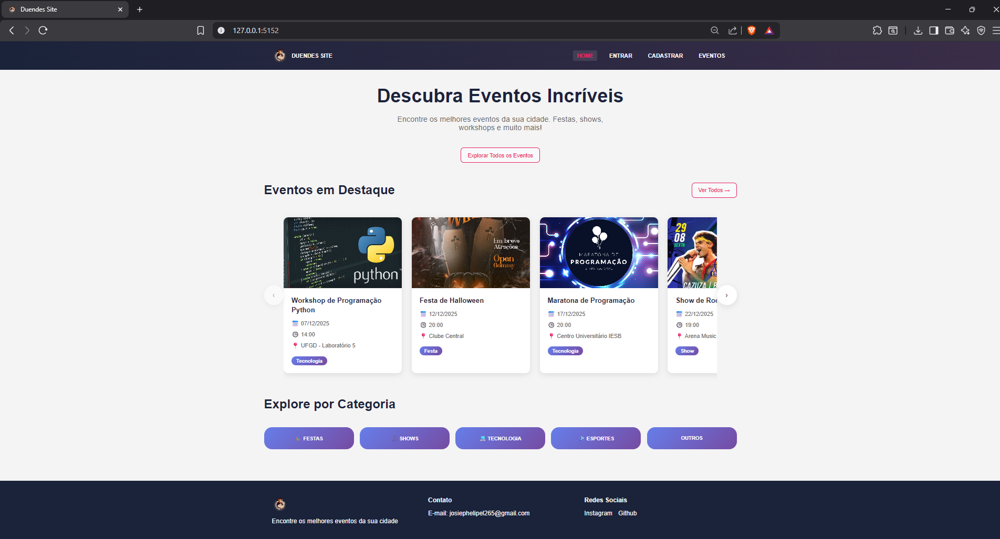

# 🎪 Duendes Site - Plataforma de Centralização de Eventos



 


Uma plataforma completa para criação, gestão e participação em eventos, desenvolvida com Flask e MySQL.

## ✨ Funcionalidades

### 👤 Para Usuários
- ✅ Cadastro e login 
- ✅ Visualização de eventos
- ✅ Inscrição em eventos
- ✅ Gerenciamento de perfil
- ✅ Lista de eventos inscritos

### 🎭 Para Organizadores
- ✅ Dashboard personalizado
- ✅ Criação e edição de eventos
- ✅ Gestão de atividades dentro dos eventos
- ✅ Estatísticas básicas
- ✅ Upload de imagens para eventos

## 🛠️ Tecnologias

- **Backend:** Python 3.8+, Flask, SQLAlchemy, WTForms
- **Banco de Dados:** MySQL 8.0+
- **Frontend:** HTML5, CSS3, JavaScript (Vanilla)
- **Ferramentas:** Git, ambiente virtual Python

## 🚀 Instalação Rápida

### Pré-requisitos

- Python 3.8 ou superior - [Download Python](https://www.python.org/downloads/)
- MySQL Server 8.0 ou superior - [Download MySQL](https://dev.mysql.com/downloads/mysql/)
- Git - [Download Git](https://git-scm.com/downloads)
- Editor de código (VSCode recomendado) - [Download VSCode](https://code.visualstudio.com/)

### Passo 1: Clonar o repositório
```bash
git clone https://github.com/Jotshh/website-duendes.git
cd website-duendes
```

### Passo 2: Configurar ambiente virtual


 Criar ambiente virtual
```bash
python -m venv venv
```

#### Ativar ambiente virtual (Windows)
```bash
venv\Scripts\activate
```
#### Ativar ambiente virtual (Linux/Mac)
```
source venv/bin/activate
```
### Passo 3: Instalar dependências
```bash
pip install -r requirements.txt
```
### Passo 4: Configurar variáveis de ambiente

#### Copie o arquivo de exemplo
```
cp .env.example .env
```
#### Edite o arquivo .env com suas configurações, Use um editor de texto 
📁 Conteúdo do arquivo .env:

```
.env

# Configurações do Flask

SECRET_KEY=sua_chave_secreta_aqui
FLASK_ENV=development
FLASK_APP=app.py

# Configurações do Banco de Dados MySQL

DB_HOST=localhost
DB_PORT=3306
DB_NAME=bd_duendes_site
DB_USER=seu_usuario_mysql
DB_PASSWORD=sua_senha_mysql

```
### Passo 5: Configurar banco de dados

Abra o MySQL Workbench

Execute o arquivo bd_duendes_site.sql para criar o banco

Verifique se as credenciais no .env correspondem às do seu MySQL

### Passo 6: Popular com dados de teste (opcional)

```
python criar_testes.py
```
### Passo 7: Executar a aplicação
```
python app.py
```
Acesse: 🌐 http://localhost:5152

## 📊 Credenciais de Teste
👤 Usuário Comum
Usuário: joaosilva

Email: joao@teste.com

Senha: 123456

## 🎭 Organizador
Email: organizador@teste.com

Senha: 123456

## 🔧 Comandos Úteis

#### Iniciar servidor de desenvolvimento
```
python app.py
```
#### Popular com dados de teste
```
python criar_testes.py
```

#### Verificar dependências instaladas
```
pip list
```

## 📄 Licença
Este projeto está licenciado sob a GNU General Public License v3.0. Veja o arquivo LICENSE para detalhes completos.

##  Suporte
Email: josiephelipel265@gmail.com
